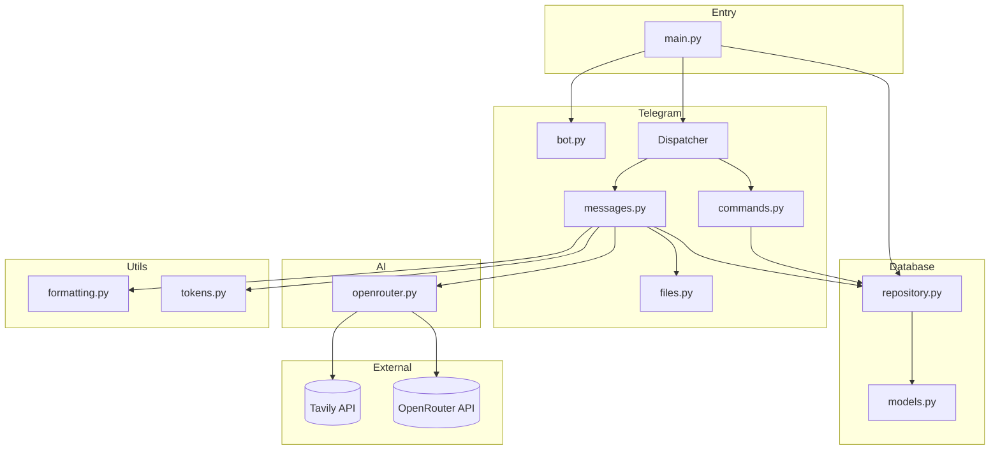
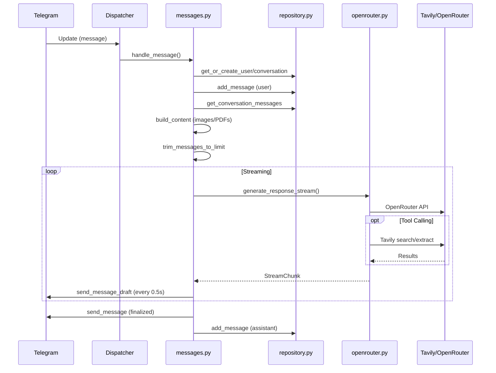
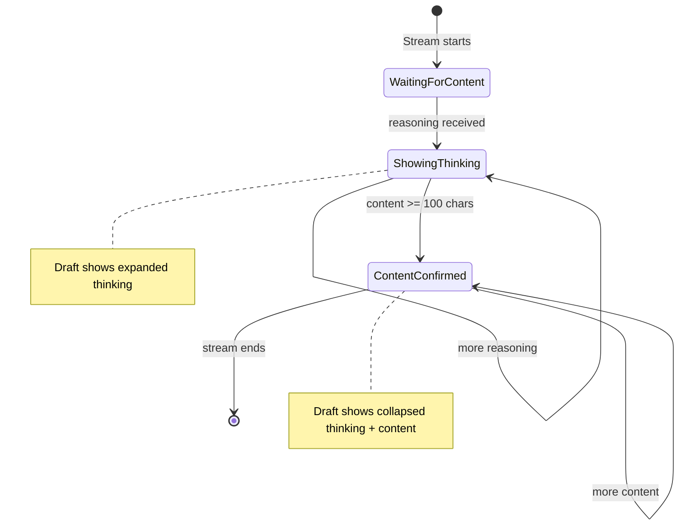

# Codebase Map

> Auto-generated by Cartographer. Last mapped: 2026-01-28

## System Overview



## Directory Structure

```
ai-tg-bot/
├── main.py              # Application entry point
├── pyproject.toml       # Project dependencies and metadata
├── .env.example         # Environment variables template
├── bot/
│   ├── __init__.py
│   ├── config.py        # Pydantic settings (singleton)
│   ├── ai/
│   │   ├── __init__.py
│   │   └── openrouter.py  # AI client with streaming, tool calling & Tavily
│   ├── database/
│   │   ├── __init__.py
│   │   ├── models.py      # SQLAlchemy ORM models
│   │   └── repository.py  # Data access layer
│   ├── telegram/
│   │   ├── __init__.py    # Exports bot, dp, router
│   │   ├── bot.py         # aiogram Bot and Dispatcher setup
│   │   ├── files.py       # File download & base64 encoding
│   │   └── handlers/
│   │       ├── __init__.py    # Main router combining all handlers
│   │       ├── commands.py    # /start and /thinking handlers
│   │       └── messages.py    # Core message processing with streaming
│   └── utils/
│       ├── __init__.py
│       ├── formatting.py  # Telegram MarkdownV2 formatting & splitting
│       └── tokens.py      # Token counting & context trimming
└── docs/
    └── CODEBASE_MAP.md    # This file
```

## Module Guide

### Entry Point (`main.py`)

**Purpose**: Application lifecycle management
**Key functions**: `main()` - initializes database, starts aiogram polling, handles shutdown

**Gotchas**:
- Sets DEBUG logging specifically for `bot.ai` module
- Only processes `message` updates (filters other Telegram event types)
- Bot session closed explicitly in finally block

### Configuration (`bot/config.py`)

**Purpose**: Centralized environment-based configuration
**Exports**: `Settings`, `settings` (singleton)
**Pattern**: Pydantic settings with `.env` file support

**Environment Variables**:
| Variable | Required | Default | Description |
|----------|----------|---------|-------------|
| `TELEGRAM_BOT_TOKEN` | Yes | - | Bot authentication |
| `OPENROUTER_API_KEY` | Yes | - | AI API access |
| `OPENROUTER_MODEL` | No | `moonshotai/kimi-k2.5` | Model ID |
| `TAVILY_API_KEY` | Yes | - | Web search API |
| `DATABASE_URL` | No | `sqlite+aiosqlite:///bot.db` | Database connection |
| `CONTEXT_TOKEN_LIMIT` | No | `8000` | Max context tokens |

**Gotchas**:
- `load_dotenv(override=True)` allows .env to override system env vars
- `extra="ignore"` silently ignores unknown environment variables

### AI Module (`bot/ai/`)

#### `openrouter.py`
**Purpose**: OpenRouter API client with streaming, tool calling, and Tavily integration
**Exports**: `StreamChunk`, `OpenRouterClient`, `openrouter_client` (singleton), `TOOLS`
**Key method**: `generate_response_stream()` - async generator yielding content/reasoning chunks
**Dependencies**: OpenAI SDK (via OpenRouter), Tavily client (lazy-initialized)

**StreamChunk fields**:
- `content` - Assistant response text
- `reasoning` - Thinking/reasoning text (only yielded when `show_thinking=True`)
- `is_final` - True on last chunk
- `is_tool_use` - True during tool execution
- `tool_name` - Name of tool being used

**Gotchas**:
- Infinite loop for multi-turn tool calling (breaks when no tool_calls)
- Streaming assembles tool calls from delta chunks (stateful accumulation)
- `reasoning_content` preserved in assistant message for model context
- Uses `model_extra` field for reasoning extraction (provider-specific)
- Tool calls interrupt streaming, execute, then continue with new API call
- Returns on any API/stream error with error message chunk
- Lazy Tavily client initialization

### Database Module (`bot/database/`)

#### `models.py`
**Purpose**: SQLAlchemy 2.0 ORM models
**Exports**: `Base`, `User`, `Conversation`, `Message`

**Schema**:
```
User (telegram_id, username, full_name, show_thinking)
  └── Conversation (user_id, chat_id, thread_id)
        └── Message (role, content, image_file_id, pdf_file_id, created_at)
```

**Gotchas**:
- Uses `BigInteger` for Telegram IDs
- `show_thinking` is per-user, not per-conversation
- Thread ID can be None (for non-threaded chats)
- Uses `datetime.utcnow` (deprecated in Python 3.12+)

#### `repository.py`
**Purpose**: Data access layer with CRUD operations
**Exports**: `Repository`, `repository` (singleton)
**Pattern**: Repository pattern with async SQLAlchemy sessions

**Key methods**:
- `get_or_create_user()` / `get_or_create_conversation()`
- `add_message()` / `get_conversation_messages()`
- `toggle_show_thinking()` - toggles user's show_thinking preference

**Gotchas**:
- Sessions must be managed by caller (no automatic commit)
- `expire_on_commit=False` keeps objects usable after commit
- `flush()` used instead of `commit()` for ID generation within transaction
- `get_or_create_user` updates username/first_name if user exists

### Telegram Module (`bot/telegram/`)

#### `bot.py`
**Purpose**: aiogram Bot and Dispatcher initialization
**Exports**: `bot`, `dp`
**Uses**: aiogram 3.24+ with Bot API 9.3 support

**Gotchas**:
- MarkdownV2 set as global default parse mode

#### `files.py`
**Purpose**: Download and base64 encode files from Telegram
**Exports**: `download_and_encode_image()`, `download_and_encode_pdf()`
**Pattern**: Returns data URL string (`data:mime/type;base64,...`)

**Gotchas**:
- Returns `None` on error (silent failure with logging)
- PDF extraction returns tuple of (data URL, filename)
- Default MIME type is `image/jpeg` if extension unknown

#### `handlers/commands.py`
**Purpose**: Command handlers using aiogram decorators
**Exports**: `router`, `cmd_start()`, `cmd_thinking()`

**Handlers**:
- `@router.message(CommandStart())` - Welcome message
- `@router.message(Command("thinking"))` - Toggle thinking traces

**Gotchas**:
- Draft ID generated from timestamp to ensure uniqueness
- `/thinking` toggles per-user preference, persists to database

#### `handlers/messages.py`
**Purpose**: Core message processing with streaming responses and draft updates
**Exports**: `router`, `handle_message()`

**Data flow**:
1. Load user, conversation, message history
2. Build multimodal content (text + images + PDFs)
3. Trim to token limit
4. Stream AI response with draft updates every 0.5s
5. Handle tool calls with status display
6. Manage thinking blocks (expanded during streaming, collapsed in final)
7. Handle message splitting for long responses
8. Save assistant response to database

**Key constants**:
- `FINAL_CONTENT_MIN_LENGTH = 100` - Prevents premature content streaming (tool planning is shorter)

**Gotchas**:
- `final_content_confirmed` flag prevents flickering between thinking and content
- Unified draft ID for both thinking and content streaming modes
- `thinking_msg_replaced` tracks if draft switched from status to content
- `pending_tool` carries tool name across chunks to prepend "(Used X)" to reasoning
- Code block tracking (`in_code_block`) for proper markdown continuation across parts
- Thinking overflow: sends collapsed blocks when exceeding ~3800 chars
- Content overflow: sends parts when approaching 4000 char limit
- Markdown fallback on parse errors (silently degrades to plain text)
- `TelegramRetryAfter` handled with sleep

### Utils Module (`bot/utils/`)

#### `formatting.py`
**Purpose**: Telegram MarkdownV2 text formatting and message splitting
**Exports**:
- `SAFE_MESSAGE_LENGTH` (3900)
- `convert_to_telegram_markdown()` - Standard markdown → MarkdownV2
- `format_thinking_expanded()` - Visible blockquote (streaming)
- `format_thinking_collapsed()` - Expandable blockquote (final)
- `format_thinking_with_content()` - Combined thinking + content
- `split_thinking()` - Smart thinking overflow split
- `split_message()` - Smart text splitting
- `find_split_point()` - Natural boundary detection

**Gotchas**:
- Safe length is 3900 (Telegram limit is 4096)
- Expanded format: each line prefixed with `>`
- Collapsed format: `**>` first line, `>` middle lines, `||` at end
- `format_thinking_block` aliased to `format_thinking_collapsed` for backwards compat
- Split prefers paragraph > line > sentence > word boundaries
- Overhead estimation: 20% for escaping + 4 chars for collapsed markers

#### `tokens.py`
**Purpose**: Token counting and context window management
**Exports**: `get_encoding()`, `count_tokens()`, `count_message_tokens()`, `trim_messages_to_limit()`

**Gotchas**:
- Uses `cl100k_base` encoding (OpenAI standard)
- Images/files estimated at 85 tokens each
- 4 base tokens added per message for formatting overhead
- Trims from oldest, keeping newest messages

## Data Flow

### Message Processing Flow



### Thinking Display Flow



## Conventions

### Code Style
- Python 3.12+ with type hints
- Async-first design (all I/O is async)
- SQLAlchemy 2.0 declarative style with `Mapped` annotations
- Pydantic for settings validation

### Patterns
- **Singleton**: All clients use global singleton instances
- **Repository**: Database access abstracted through Repository class
- **Async Generator**: Streaming responses via `async for`
- **Draft Messages**: Real-time updates using Telegram Bot API 9.3
- **aiogram Routers**: Handlers organized by routers with decorator-based registration
- **Lazy Initialization**: Tavily client, tiktoken encoding

### Naming
- `*_client` suffix for API clients
- `cmd_*` prefix for command handlers (aiogram convention)
- `handle_*` prefix for message handlers
- `get_or_create_*` for upsert operations
- `*_file_id` for Telegram file references

### Error Handling
- aiogram uses exception-based error handling
- `TelegramBadRequest` for API errors (check `"parse"` in message for markdown issues)
- `TelegramRetryAfter` for rate limiting
- Markdown parse errors fall back to plain text

## Gotchas

### Critical
1. **Content confirmation threshold**: 100 chars minimum before switching from thinking to content display (prevents flickering during tool planning)

### Important
2. **Model-specific behavior**: Reasoning extracted from `model_extra.get("reasoning")` - not all models support this
3. **Hardcoded limits**: 3900 char message length, 85 tokens per image, 0.5s draft update interval
4. **Silent failures**: File utilities return `None` on error instead of raising

### Architectural
5. **Manual transactions**: Repository uses `flush()`, caller must `commit()`
6. **Unified draft handling**: Single draft ID used for both thinking and content modes
7. **State machine complexity**: `messages.py` has multiple flags for streaming state management

## Navigation Guide

**To add a new command**:
1. Add handler function in `bot/telegram/handlers/commands.py` with `@router.message(Command("name"))`
2. Router is automatically included via `bot/telegram/handlers/__init__.py`

**To add a new AI tool**:
1. Add schema to `TOOLS` list in `bot/ai/openrouter.py`
2. Add execution logic in `_execute_tool()` method in same file
3. Add tool-specific status message in `bot/telegram/handlers/messages.py` (around line 80)

**To modify database schema**:
1. Update models in `bot/database/models.py`
2. Update repository methods in `bot/database/repository.py`
3. Handle migration (manual - no Alembic configured)

**To change AI model**:
1. Update `OPENROUTER_MODEL` in `.env`
2. Check if model supports reasoning field in `model_extra` (for thinking traces)

**To add new message content type**:
1. Add utility in `bot/telegram/files.py`
2. Update `bot/telegram/handlers/messages.py` to handle new type in content building
3. Optionally add field to Message model for file_id storage

**To modify thinking display**:
1. `format_thinking_expanded()` - streaming appearance
2. `format_thinking_collapsed()` - final appearance
3. `FINAL_CONTENT_MIN_LENGTH` in `messages.py` - confirmation threshold
