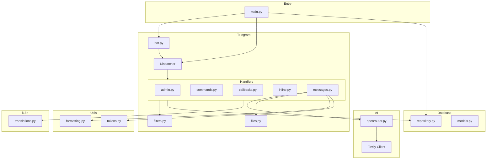
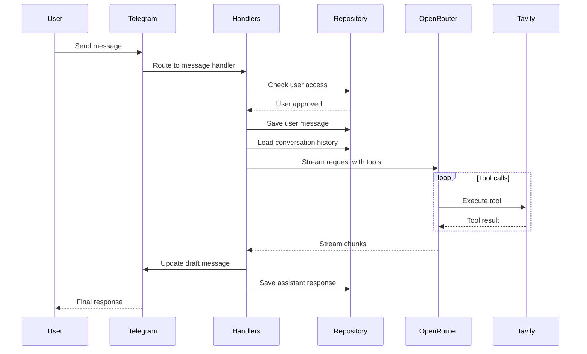

# Codebase Map

> Auto-generated by Cartographer. Last mapped: 2026-02-01

## System Overview



## Directory Structure

```
ai-tg-bot/
├── main.py                 # Entry point with command registration
├── bot/
│   ├── config.py           # Pydantic settings from environment
│   ├── ai/
│   │   └── openrouter.py   # OpenRouter client with streaming & tools
│   ├── database/
│   │   ├── models.py       # SQLAlchemy ORM models
│   │   └── repository.py   # Async CRUD operations
│   ├── i18n/
│   │   └── translations.py # Multi-language translations (EN/RU/UK)
│   ├── telegram/
│   │   ├── bot.py          # Bot and Dispatcher singletons
│   │   ├── files.py        # File download and base64 encoding
│   │   ├── filters.py      # Access control filters
│   │   └── handlers/
│   │       ├── admin.py    # Admin commands (/invite, /invites, etc.)
│   │       ├── callbacks.py # Inline keyboard callbacks
│   │       ├── commands.py # User commands (/start, /help, etc.)
│   │       ├── inline.py   # Inline query for sharing invites
│   │       └── messages.py # Message handling with AI streaming
│   └── utils/
│       ├── formatting.py   # Telegram MarkdownV2 formatting
│       └── tokens.py       # Token counting and context trimming
├── docs/
│   └── CODEBASE_MAP.md     # This file
├── SYS_PROMPT.md           # AI system prompt template
├── docker-compose.yml      # Docker orchestration with PostgreSQL
├── Dockerfile              # Multi-stage build with uv
└── .github/workflows/
    └── docker.yml          # Multi-platform Docker CI/CD
```

## Module Guide

### Entry Point (`main.py`)

**Purpose**: Application initialization and bot command registration.

| Function | Purpose |
|----------|---------|
| `make_commands()` | Build BotCommand list from translation keys |
| `set_bot_commands()` | Register commands per language + admin scopes |
| `main()` | Initialize DB, register commands, start polling |

**Key Features**:
- Multi-language command descriptions (EN/RU/UK)
- Separate admin command scope
- Allowed updates: message, callback_query, inline_query, chosen_inline_result

---

### Configuration (`bot/config.py`)

**Purpose**: Centralized configuration using pydantic-settings.

| Setting | Default | Description |
|---------|---------|-------------|
| `telegram_bot_token` | required | Bot token from @BotFather |
| `openrouter_api_key` | required | OpenRouter API key |
| `openrouter_model` | `moonshotai/kimi-k2.5` | Model ID |
| `tavily_api_key` | required | Tavily API key |
| `database_url` | `sqlite+aiosqlite:///bot.db` | SQLAlchemy URL |
| `context_token_limit` | `8000` | Max context tokens |
| `admin_ids` | `[]` | Admin Telegram IDs |

---

### AI Module (`bot/ai/`)

**Purpose**: OpenRouter API client with streaming, tool calling, and Tavily integration.

| Component | Purpose |
|-----------|---------|
| `StreamChunk` | Dataclass for streaming response chunks |
| `OpenRouterClient` | Main client with `generate_response_stream()` |
| `TOOLS` | Tool definitions for web_search and extract_webpage |

**Data Flow**:
1. Stream chat completion with tools enabled
2. Accumulate content/reasoning/tool_calls from deltas
3. If tool_calls present, execute via Tavily and append results
4. Loop until no more tool calls
5. Yield StreamChunk for each delta

**Gotchas**:
- Tool calls streamed incrementally - use `_accumulate_tool_call` to build complete calls
- Reasoning only yielded when `show_thinking=True`
- Max 5 search results, "basic" search depth

---

### Database Module (`bot/database/`)

**Purpose**: SQLAlchemy 2.0 async ORM with repository pattern.

#### Models

| Model | Key Fields |
|-------|------------|
| `User` | telegram_id, show_thinking, language, timezone_offset, invited_by_code |
| `Conversation` | user_id, chat_id, thread_id, unique constraint on (chat_id, thread_id) |
| `Message` | conversation_id, role, content, image_file_id, pdf_file_id, message_id |
| `InviteCode` | code, created_by, max_uses, current_uses, is_active |

#### Repository Methods

| Category | Methods |
|----------|---------|
| User | `get_or_create_user`, `toggle_show_thinking`, `update_user_language`, `update_user_timezone` |
| Conversation | `get_or_create_conversation`, `get_conversation_messages` |
| Message | `add_message`, `get_latest_assistant_response`, `delete_latest_assistant_response` |
| Invite | `create_invite_code`, `use_invite_code`, `get_all_invite_codes`, `delete_invite_code` |

**Gotchas**:
- `timezone_offset` stored in minutes (not hours)
- BigInteger for Telegram IDs (supports large user IDs)
- Cascade deletes for all relationships

---

### i18n Module (`bot/i18n/`)

**Purpose**: Multi-language translations with auto-detection.

| Language | Code | Telegram Codes |
|----------|------|----------------|
| English | EN | en |
| Russian | RU | ru, be, kk |
| Ukrainian | UK | uk, ua |

**Translation Categories**:
- Command descriptions (`cmd_*_desc`)
- Welcome/help messages
- Thinking toggle status
- Invite system messages
- Admin command responses
- Timezone messages

**Gotchas**:
- All translations pre-escaped for MarkdownV2
- Fallback to English if language not found

---

### Telegram Module (`bot/telegram/`)

#### Handlers

| Handler | Purpose | Filter |
|---------|---------|--------|
| `admin.py` | `/invite`, `/invites`, `/deleteinvite`, `/approve` | AdminFilter |
| `commands.py` | `/start`, `/help`, `/lang`, `/thinking`, `/redo`, `/edit`, `/code`, `/timezone` | None |
| `callbacks.py` | Language selection callbacks | None |
| `inline.py` | Inline queries for invite sharing | Admin only |
| `messages.py` | AI message handling with streaming | ApprovedUserFilter |

#### Filters

| Filter | Purpose |
|--------|---------|
| `AdminFilter` | Checks if user ID in `settings.admin_ids` |
| `ApprovedUserFilter` | User is admin OR exists in database |

#### Key Features

**Streaming Response** (`messages.py`):
- Draft messages for real-time updates (Bot API 9.3)
- Thinking displayed expanded while streaming, collapsed when done
- Tool status with emoji and counter
- Content overflow handling with code block continuity
- Markdown fallback on parse errors

**Invite System** (`admin.py`, `inline.py`):
- Random or custom invite codes
- Inline query sharing with per-language results
- Auto-increment uses for exhausted custom codes

---

### Utils Module (`bot/utils/`)

| File | Exports |
|------|---------|
| `formatting.py` | `convert_to_telegram_markdown`, `format_thinking_*`, `split_message`, `generate_draft_id`, `generate_invite_code` |
| `tokens.py` | `count_tokens`, `trim_messages_to_limit` |

**Constants**:
- `SAFE_MESSAGE_LENGTH = 3900` (safety margin below Telegram's 4096)

---

## Data Flow



## Conventions

- **Async everywhere**: All I/O operations are async
- **Singleton pattern**: `bot`, `dp`, `settings`, `repository`, `openrouter_client`
- **Router organization**: Handlers grouped by function with aiogram routers
- **MarkdownV2**: All user-facing text escaped for Telegram
- **UTC timestamps**: All database timestamps in UTC, converted to user timezone for display

## Gotchas

1. **Access Control**: Admins auto-approved, others need invite code or pre-approval via `/approve`
2. **Invite Codes**: Custom codes via inline queries auto-increment uses if exhausted
3. **Message Splitting**: Code blocks reopened with ``` when split across messages
4. **Thinking Display**: Expanded (>) while streaming, collapsed (**>||) when finalized
5. **Tool Loop**: AI can call tools multiple times, automatically executed and re-streamed
6. **Draft Messages**: Require unique IDs, uses timestamp in milliseconds
7. **Token Counting**: Images and PDFs count as ~85 tokens each
8. **Context Trimming**: System message added AFTER trimming (not included in limit)
9. **Timezone Storage**: Offset stored in minutes, rounded to 15-minute intervals
10. **Database**: BigInteger used for Telegram IDs (supports very large user IDs)

## Navigation Guide

**To add a new command**:
1. Add translation keys to `bot/i18n/translations.py`
2. Add command key to `USER_COMMAND_KEYS` or `ADMIN_COMMAND_KEYS` in `main.py`
3. Create handler in appropriate file under `bot/telegram/handlers/`

**To add a new tool**:
1. Add tool definition to `TOOLS` in `bot/ai/openrouter.py`
2. Add execution logic to `_execute_tool()`
3. Add status translation keys to `bot/i18n/translations.py`

**To modify database schema**:
1. Update models in `bot/database/models.py`
2. Add repository methods in `bot/database/repository.py`
3. Database tables auto-created on startup (no migrations)

**To add a new language**:
1. Add to `Language` enum in `bot/i18n/translations.py`
2. Add translations to `TRANSLATIONS` dict
3. Update language mappings in `detect_language()`
4. Add keyboard button in `_build_language_keyboard()` in `commands.py`
