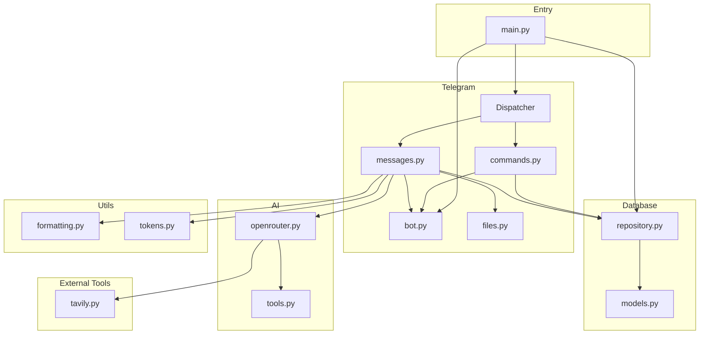
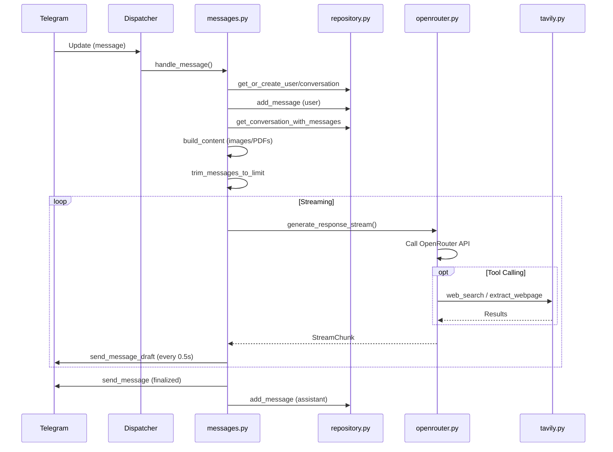
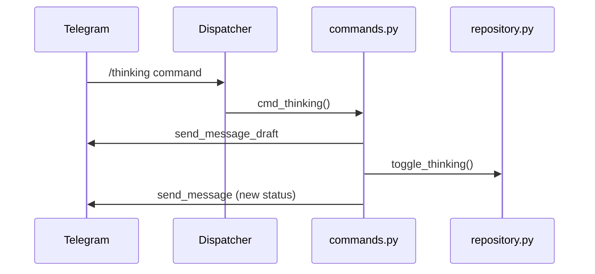

# Codebase Map

> Auto-generated by Cartographer. Last mapped: 2026-01-27

## System Overview



## Directory Structure

```
ai-tg-bot/
├── main.py              # Application entry point
├── pyproject.toml       # Project dependencies and metadata
├── .env.example         # Environment variables template
├── bot/
│   ├── __init__.py
│   ├── config.py        # Pydantic settings (singleton)
│   ├── ai/
│   │   ├── __init__.py
│   │   ├── openrouter.py  # AI client with streaming & tool calling
│   │   └── tools.py       # OpenAI function calling schemas
│   ├── database/
│   │   ├── __init__.py
│   │   ├── models.py      # SQLAlchemy ORM models
│   │   └── repository.py  # Data access layer
│   ├── telegram/
│   │   ├── __init__.py    # Exports bot, dp, router
│   │   ├── bot.py         # aiogram Bot and Dispatcher setup
│   │   ├── files.py       # File download & base64 encoding
│   │   └── handlers/
│   │       ├── __init__.py    # Main router combining all handlers
│   │       ├── commands.py    # /start and /thinking handlers
│   │       └── messages.py    # Core message processing
│   ├── tools/
│   │   ├── __init__.py
│   │   └── tavily.py      # Web search & extraction
│   └── utils/
│       ├── __init__.py
│       ├── formatting.py  # Telegram MarkdownV2 formatting
│       └── tokens.py      # Token counting & context trimming
└── docs/
    └── CODEBASE_MAP.md    # This file
```

## Module Guide

### Entry Point (`main.py`)

**Purpose**: Application lifecycle management
**Key functions**: `main()` - initializes database, starts aiogram polling, handles shutdown

### Configuration (`bot/config.py`)

**Purpose**: Centralized environment-based configuration
**Exports**: `Settings`, `settings` (singleton)
**Pattern**: Pydantic settings with `.env` file support

**Environment Variables**:
| Variable | Required | Default | Description |
|----------|----------|---------|-------------|
| `TELEGRAM_BOT_TOKEN` | Yes | - | Bot authentication |
| `OPENROUTER_API_KEY` | Yes | - | AI API access |
| `OPENROUTER_MODEL` | No | `moonshotai/kimi-k2.5` | Model ID |
| `TAVILY_API_KEY` | Yes | - | Web search API |
| `DATABASE_URL` | No | `sqlite+aiosqlite:///bot.db` | Database connection |
| `CONTEXT_TOKEN_LIMIT` | No | `8000` | Max context tokens |

### AI Module (`bot/ai/`)

#### `openrouter.py`
**Purpose**: OpenRouter API client with streaming and tool calling
**Exports**: `StreamChunk`, `OpenRouterClient`, `openrouter_client` (singleton)
**Key method**: `generate_response_stream()` - async generator yielding content/reasoning chunks
**Dependencies**: OpenAI SDK, Tavily client

**Gotchas**:
- Max 6 tool calling iterations (hardcoded)
- Reasoning extracted from `delta.model_extra.get("reasoning")` (model-specific)
- Only supports `web_search` and `extract_webpage` tools

#### `tools.py`
**Purpose**: OpenAI function calling schema definitions
**Exports**: `TOOLS` - list of tool schemas

### Database Module (`bot/database/`)

#### `models.py`
**Purpose**: SQLAlchemy 2.0 ORM models
**Exports**: `Base`, `User`, `Conversation`, `Message`

**Schema**:
```
User (telegram_id, username, full_name, show_thinking)
  └── Conversation (user_id, chat_id, thread_id)
        └── Message (role, content, image_file_id, pdf_file_id, created_at)
```

**Gotchas**:
- Uses `BigInteger` for Telegram IDs
- `show_thinking` is per-user, not per-conversation
- Uses deprecated `datetime.utcnow` (Python 3.12+)

#### `repository.py`
**Purpose**: Data access layer with CRUD operations
**Exports**: `Repository`, `repository` (singleton)
**Pattern**: Repository pattern with async SQLAlchemy sessions

**Key methods**:
- `get_or_create_user()` / `get_or_create_conversation()`
- `add_message()` / `get_conversation_with_messages()`
- `trim_messages_to_limit()` - removes old messages beyond token limit

### Telegram Module (`bot/telegram/`)

#### `bot.py`
**Purpose**: aiogram Bot and Dispatcher initialization
**Exports**: `bot`, `dp`
**Uses**: aiogram 3.24+ with Bot API 9.3 support

#### `files.py`
**Purpose**: Download and base64 encode files from Telegram
**Exports**: `download_and_encode_image()`, `download_and_encode_pdf()`
**Pattern**: Returns data URL string (`data:mime/type;base64,...`)
**Gotchas**: Returns `None` on error (silent failure with logging)

#### `handlers/commands.py`
**Purpose**: Command handlers using aiogram decorators
**Exports**: `router`, `cmd_start()`, `cmd_thinking()`

**Handlers**:
- `@router.message(CommandStart())` - Welcome message
- `@router.message(Command("thinking"))` - Toggle thinking traces

#### `handlers/messages.py`
**Purpose**: Core message processing with streaming responses
**Exports**: `router`, `handle_message()`

**Data flow**:
1. Load user, conversation, message history
2. Build multimodal content (text + images + PDFs)
3. Trim to token limit
4. Stream AI response with draft updates every 0.5s
5. Handle message splitting for long responses
6. Save assistant response to database

**Gotchas**:
- Separate draft IDs for thinking vs content
- Code block state tracked across message splits
- Falls back to plain text on MarkdownV2 parse errors
- Rate limiting handled with TelegramRetryAfter exception

### Tools Module (`bot/tools/`)

#### `tavily.py`
**Purpose**: Async wrapper for Tavily web search/extraction
**Exports**: `TavilyClient`, `tavily_client` (singleton)

**Methods**:
- `search(query)` - web search (max 5 results, basic depth)
- `extract(url)` - webpage content extraction

**Gotchas**:
- Returns error dict instead of raising exceptions
- Only uses first result from extract response

### Utils Module (`bot/utils/`)

#### `formatting.py`
**Purpose**: Telegram MarkdownV2 text formatting
**Exports**: `SAFE_MESSAGE_LENGTH` (3900), escaping functions, `format_thinking_block()`, `split_message()`

**Gotchas**:
- Safe length is 3900 (Telegram limit is 4096)
- Expandable blockquote format: `**>` first line, `||` last line
- Split prefers paragraph > line > sentence > word boundaries

#### `tokens.py`
**Purpose**: Token counting and context window management
**Exports**: `get_encoding()`, `count_tokens()`, `count_message_tokens()`, `trim_messages_to_limit()`

**Gotchas**:
- Uses `cl100k_base` encoding (OpenAI standard)
- Images/files estimated at 85 tokens each
- 4 base tokens added per message for formatting overhead

## Data Flow

### Message Processing Flow



### /thinking Command Flow



## Conventions

### Code Style
- Python 3.12+ with type hints
- Async-first design (all I/O is async)
- SQLAlchemy 2.0 declarative style with `Mapped` annotations
- Pydantic for settings validation

### Patterns
- **Singleton**: All clients use global singleton instances
- **Repository**: Database access abstracted through Repository class
- **Async Generator**: Streaming responses via `async for`
- **Draft Messages**: Real-time updates using Telegram Bot API 9.3
- **aiogram Routers**: Handlers organized by routers with decorator-based registration

### Naming
- `*_client` suffix for API clients
- `cmd_*` prefix for command handlers (aiogram convention)
- `handle_*` prefix for message handlers
- `get_or_create_*` for upsert operations
- `*_file_id` for Telegram file references

### Error Handling
- aiogram uses exception-based error handling
- `TelegramBadRequest` for API errors (check `"parse"` in message for markdown issues)
- `TelegramRetryAfter` for rate limiting

## Gotchas

### Critical
1. **Deprecated datetime**: `datetime.utcnow` used in models (Python 3.12+ deprecation)

### Important
2. **Model-specific behavior**: Reasoning extracted from `model_extra.get("reasoning")`
3. **Hardcoded limits**: Max 6 tool rounds, 3900 char message length, 85 tokens per image
4. **Silent failures**: File utilities return `None` on error instead of raising

### Architectural
5. **Manual transactions**: Repository uses `flush()`, caller must `commit()`
6. **Thread safety**: Global singletons may cause issues in multi-threaded environments

## Navigation Guide

**To add a new command**:
1. Add handler function in `bot/telegram/handlers/commands.py` with `@router.message(Command("name"))`
2. Router is automatically included via `bot/telegram/handlers/__init__.py`

**To add a new AI tool**:
1. Add schema in `bot/ai/tools.py`
2. Add execution logic in `bot/ai/openrouter.py:generate_response_stream()` (tool_call handling)
3. Add client in `bot/tools/` if external API needed

**To modify database schema**:
1. Update models in `bot/database/models.py`
2. Update repository methods in `bot/database/repository.py`
3. Handle migration (manual - no Alembic configured)

**To change AI model**:
1. Update `OPENROUTER_MODEL` in `.env`
2. Check if model supports reasoning field in `model_extra` (for thinking traces)

**To add new message content type**:
1. Add utility in `bot/telegram/files.py`
2. Update `bot/telegram/handlers/messages.py:_build_content()` to handle new type
3. Optionally add field to Message model for file_id storage
