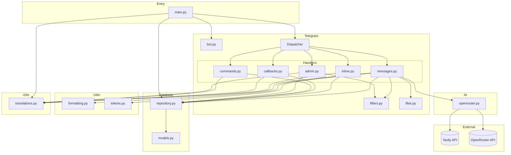
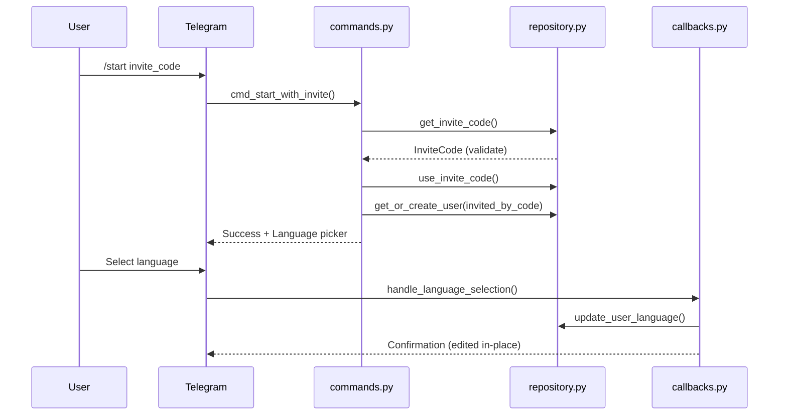
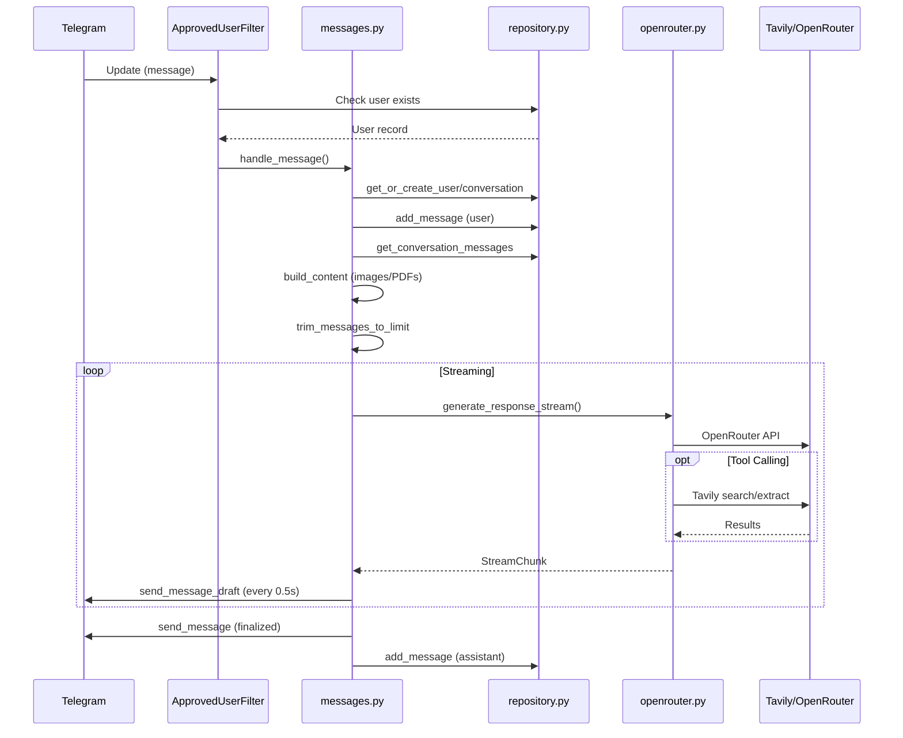
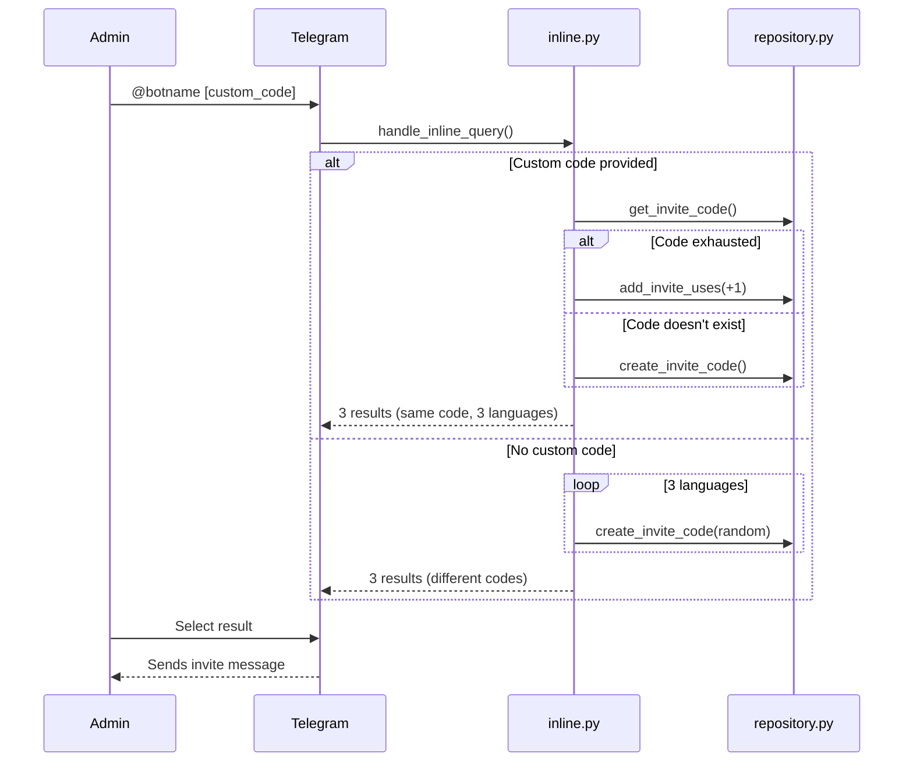
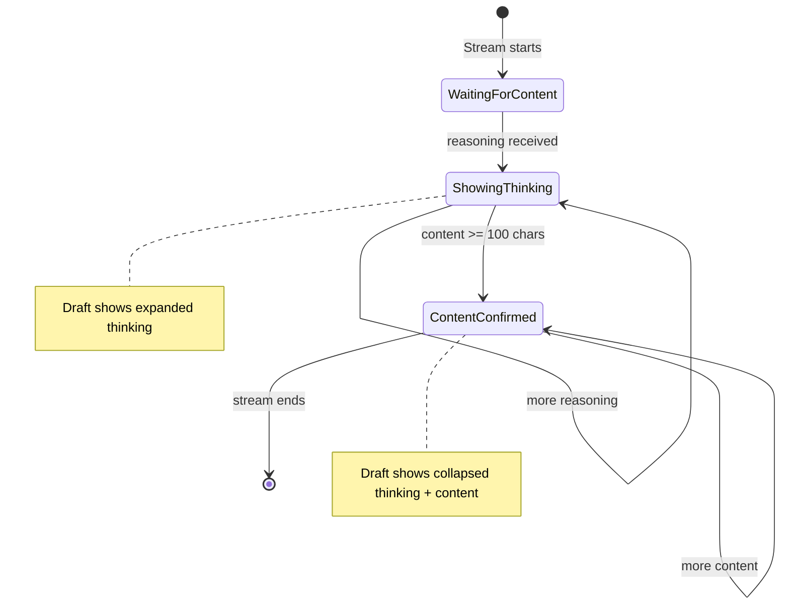

# Codebase Map

> Auto-generated by Cartographer. Last mapped: 2026-01-30

## System Overview



## Directory Structure

```
ai-tg-bot/
├── main.py              # Application entry point with command registration
├── pyproject.toml       # Project dependencies and metadata
├── .env.example         # Environment variables template
├── bot/
│   ├── __init__.py
│   ├── config.py        # Pydantic settings with admin_ids
│   ├── ai/
│   │   ├── __init__.py
│   │   └── openrouter.py  # AI client with streaming, tool calling & Tavily
│   ├── database/
│   │   ├── __init__.py
│   │   ├── models.py      # SQLAlchemy ORM models (User, Conversation, Message, InviteCode)
│   │   └── repository.py  # Data access layer with invite code CRUD
│   ├── i18n/
│   │   ├── __init__.py    # Exports Language, get_text, detect_language
│   │   └── translations.py  # Multi-language translations (EN/RU/UK)
│   ├── telegram/
│   │   ├── __init__.py    # Exports bot, dp, router
│   │   ├── bot.py         # aiogram Bot and Dispatcher setup
│   │   ├── files.py       # File download & base64 encoding
│   │   ├── filters.py     # AdminFilter, ApprovedUserFilter
│   │   └── handlers/
│   │       ├── __init__.py    # Main router combining all handlers
│   │       ├── admin.py       # Admin commands (/invite, /invites, /approve)
│   │       ├── callbacks.py   # Callback query handlers (language selection)
│   │       ├── commands.py    # User commands (/start, /help, /lang, /code, /redo, /edit)
│   │       ├── inline.py      # Inline mode for sharing invite codes
│   │       └── messages.py    # Core message processing with streaming
│   └── utils/
│       ├── __init__.py
│       ├── formatting.py  # Telegram MarkdownV2 formatting & splitting
│       └── tokens.py      # Token counting & context trimming
└── docs/
    └── CODEBASE_MAP.md    # This file
```

## Module Guide

### Entry Point (`main.py`)

**Purpose**: Application lifecycle management with multi-language command registration
**Key functions**:
- `main()` - Initializes database, registers commands, starts aiogram polling
- `set_bot_commands()` - Registers localized commands per language and admin scope

**Command Registration**:
- Default scope: User commands for all users (per language)
- Admin scope: User + admin commands (per admin ID, per language)
- Allowed updates: `message`, `callback_query`, `inline_query`, `chosen_inline_result`

**Gotchas**:
- Commands registered 3 times per scope (once per language: EN/RU/UK)
- Admin-specific menus use `BotCommandScopeChat` per admin ID
- Bot session closed explicitly in finally block

### Configuration (`bot/config.py`)

**Purpose**: Centralized environment-based configuration
**Exports**: `Settings`, `settings` (singleton)
**Pattern**: Pydantic settings with `.env` file support

**Environment Variables**:
| Variable | Required | Default | Description |
|----------|----------|---------|-------------|
| `TELEGRAM_BOT_TOKEN` | Yes | - | Bot authentication |
| `OPENROUTER_API_KEY` | Yes | - | AI API access |
| `OPENROUTER_MODEL` | No | `moonshotai/kimi-k2.5` | Model ID |
| `TAVILY_API_KEY` | Yes | - | Web search API |
| `DATABASE_URL` | No | `sqlite+aiosqlite:///bot.db` | Database connection |
| `CONTEXT_TOKEN_LIMIT` | No | `8000` | Max context tokens |
| `ADMIN_IDS` | No | `[]` | Comma-separated admin Telegram IDs |

**Gotchas**:
- `load_dotenv(override=True)` allows .env to override system env vars
- `extra="ignore"` silently ignores unknown environment variables
- Empty `ADMIN_IDS` results in no admins - bot inaccessible to new users!
- Format: `ADMIN_IDS=123456789,987654321` (comma-separated, no spaces)

### i18n Module (`bot/i18n/`)

#### `translations.py`
**Purpose**: Central translation database with 50+ keys for EN/RU/UK
**Exports**: `Language` (enum), `TRANSLATIONS`, `detect_language()`, `get_text()`

**Language Detection**:
- `uk`, `ua` → Ukrainian
- `ru`, `be`, `kk` → Russian (Belarusian/Kazakh fallback to Russian)
- All other → English

**Translation Categories**:
- Command descriptions (`cmd_*_desc`) - For Telegram command menu
- Welcome/help (`start_welcome`, `help_text`) - User onboarding
- Language UI (`lang_select`, `lang_changed`) - Language picker
- Status messages (`status_thinking`, `status_searching`) - With emojis
- Invite system (`invite_*`) - All invite-related messages
- Admin commands (`admin_only`, `invite_created`, etc.)

**Gotchas**:
- All strings pre-escaped for MarkdownV2 (`.`, `-`, `(`, `)`, etc.)
- Fallback chain: requested language → English → key string itself
- `get_text()` accepts both `Language` enum and string codes
- Format placeholders: `{code}`, `{bot_name}`, `{max_uses}`, etc.

### AI Module (`bot/ai/`)

#### `openrouter.py`
**Purpose**: OpenRouter API client with streaming, tool calling, and Tavily integration
**Exports**: `StreamChunk`, `OpenRouterClient`, `openrouter_client` (singleton), `TOOLS`
**Key method**: `generate_response_stream()` - async generator yielding content/reasoning chunks
**Dependencies**: OpenAI SDK (via OpenRouter), Tavily client (lazy-initialized)

**StreamChunk fields**:
- `content` - Assistant response text
- `reasoning` - Thinking/reasoning text (only yielded when `show_thinking=True`)
- `is_final` - True on last chunk
- `is_tool_use` - True during tool execution
- `tool_name` - Name of tool being used

**Gotchas**:
- Infinite loop for multi-turn tool calling (breaks when no tool_calls)
- Streaming assembles tool calls from delta chunks (stateful accumulation)
- `reasoning_content` preserved in assistant message for model context
- Uses `model_extra` field for reasoning extraction (provider-specific)
- Tool calls interrupt streaming, execute, then continue with new API call
- Returns on any API/stream error with error message chunk
- Lazy Tavily client initialization

### Database Module (`bot/database/`)

#### `models.py`
**Purpose**: SQLAlchemy 2.0 ORM models
**Exports**: `Base`, `User`, `Conversation`, `Message`, `InviteCode`

**Schema**:
```
User (telegram_id, username, first_name, show_thinking, language, invited_by_code)
  └── Conversation (user_id, chat_id, thread_id)
        └── Message (role, content, message_id, image_file_id, pdf_file_id, created_at)

InviteCode (code, created_by, max_uses, current_uses, is_active, created_at)
```

**Gotchas**:
- Uses `BigInteger` for Telegram IDs
- `show_thinking` and `language` are per-user, not per-conversation
- Thread ID can be None (for non-threaded chats)
- `invited_by_code` is nullable (admins can be pre-approved)
- `InviteCode.created_by` stores telegram_id, not User.id (no FK constraint)
- Uses `datetime.utcnow` (deprecated in Python 3.12+)

#### `repository.py`
**Purpose**: Data access layer with CRUD operations
**Exports**: `Repository`, `repository` (singleton)
**Pattern**: Repository pattern with async SQLAlchemy sessions

**Key methods**:
- User: `get_or_create_user()`, `get_user_by_telegram_id()`, `update_user_language()`, `get_user_language()`, `toggle_show_thinking()`
- Conversation: `get_or_create_conversation()`
- Message: `add_message()`, `get_conversation_messages()`, `get_latest_user_message()`, `delete_latest_assistant_response()`
- Invite: `create_invite_code()`, `get_invite_code()`, `get_all_invite_codes()`, `use_invite_code()`, `add_invite_uses()`, `delete_invite_code()`, `create_user_by_id()`

**Gotchas**:
- Sessions must be managed by caller (no automatic commit)
- `expire_on_commit=False` keeps objects usable after commit
- `flush()` used instead of `commit()` for ID generation within transaction
- `use_invite_code()` returns `False` if code exhausted
- `add_invite_uses()` does nothing if code is unlimited (`max_uses=None`)
- Soft delete for invite codes (sets `is_active=False`)

### Telegram Module (`bot/telegram/`)

#### `bot.py`
**Purpose**: aiogram Bot and Dispatcher initialization
**Exports**: `bot`, `dp`
**Uses**: aiogram 3.24+ with Bot API 9.3 support

**Gotchas**:
- MarkdownV2 set as global default parse mode

#### `files.py`
**Purpose**: Download and base64 encode files from Telegram
**Exports**: `download_and_encode_image()`, `download_and_encode_pdf()`
**Pattern**: Returns data URL string (`data:mime/type;base64,...`)

**Gotchas**:
- Returns `None` on error (silent failure with logging)
- PDF extraction returns tuple of (data URL, filename)
- Default MIME type is `image/jpeg` if extension unknown

#### `filters.py`
**Purpose**: Custom aiogram filters for access control
**Exports**: `AdminFilter`, `ApprovedUserFilter`

**Filters**:
- `AdminFilter` - Allows only users in `settings.admin_ids`
- `ApprovedUserFilter` - Allows admins OR users with database records

**Gotchas**:
- Filters create database sessions for each message check
- Admins bypass database check (early return)
- Silent blocking: unapproved users get no response

#### `handlers/__init__.py`
**Purpose**: Aggregates all handler routers into single main router

**Router Order** (specificity matters):
1. `admin_router` (with AdminFilter)
2. `commands_router`
3. `callbacks_router`
4. `inline_router`
5. `messages_router` (catch-all with ApprovedUserFilter)

#### `handlers/admin.py`
**Purpose**: Admin commands for invite code management
**Exports**: `router` (with global AdminFilter)

**Commands**:
| Command | Usage | Description |
|---------|-------|-------------|
| `/invite` | `/invite [code] [max_uses]` | Create invite code |
| `/invites` | `/invites` | List all active invite codes |
| `/deleteinvite` | `/deleteinvite <code>` | Soft-delete an invite code |
| `/approve` | `/approve <telegram_id>` | Pre-approve user without invite |

**Gotchas**:
- Default `max_uses=1` when not specified
- Uses `?text=/code {code}` URL format for pre-filling commands

#### `handlers/callbacks.py`
**Purpose**: Callback query handlers for inline keyboards
**Exports**: `router`

**Handlers**:
- `lang:*` - Language selection callback

**Gotchas**:
- Edits message in-place instead of delete+send
- Falls back to new message if edit fails
- Includes welcome text if language differs from auto-detected

#### `handlers/commands.py`
**Purpose**: User command handlers
**Exports**: `router`

**Commands**:
| Command | Description |
|---------|-------------|
| `/start [code]` | Welcome with optional invite code |
| `/help` | Show help text |
| `/lang` | Show language picker |
| `/code <code>` | Manually redeem invite code |
| `/thinking` | Toggle thinking traces |
| `/redo` | Regenerate last response |
| `/edit <text>` | Edit last prompt and regenerate |

**Gotchas**:
- Two `/start` handlers (with/without deep link) using filter specificity
- Admins auto-bypass invite requirements
- `/edit` requires space after command

#### `handlers/inline.py`
**Purpose**: Inline mode for sharing invite codes
**Exports**: `router`, `LANG_NAMES`

**Behavior**:
- `@botname` - Generates 3 random codes (one per language)
- `@botname mycode` - Uses custom code for all 3 results, auto-replenishes if exhausted

**Gotchas**:
- Only admins can use inline mode
- Creates codes with `max_uses=1` by default
- Auto-increments `max_uses` by 1 if custom code is exhausted

#### `handlers/messages.py`
**Purpose**: Core message processing with streaming responses and draft updates
**Exports**: `router`, `handle_message()`, `generate_and_stream_response()`

**Data flow**:
1. Filter: ApprovedUserFilter blocks unapproved users
2. Load user, conversation, message history
3. Build multimodal content (text + images + PDFs)
4. Trim to token limit
5. Stream AI response with draft updates every 0.5s
6. Handle tool calls with localized status display
7. Manage thinking blocks (expanded during streaming, collapsed in final)
8. Handle message splitting for long responses
9. Save assistant response to database

**Key constants**:
- `FINAL_CONTENT_MIN_LENGTH = 100` - Prevents premature content streaming

**Gotchas**:
- `final_content_confirmed` flag prevents flickering between thinking and content
- Unified draft ID for both thinking and content streaming modes
- Status messages use `get_text('status_*', lang)` for localization
- Markdown fallback on parse errors (silently degrades to plain text)

### Utils Module (`bot/utils/`)

#### `formatting.py`
**Purpose**: Telegram MarkdownV2 text formatting and message splitting
**Exports**:
- `SAFE_MESSAGE_LENGTH` (3900)
- `convert_to_telegram_markdown()` - Standard markdown → MarkdownV2
- `format_thinking_expanded()` - Visible blockquote (streaming)
- `format_thinking_collapsed()` - Expandable blockquote (final)
- `format_thinking_with_content()` - Combined thinking + content
- `split_thinking()` - Smart thinking overflow split
- `split_message()` - Smart text splitting

**Gotchas**:
- Safe length is 3900 (Telegram limit is 4096)
- Expanded format: each line prefixed with `>`
- Collapsed format: `**>` first line, `>` middle lines, `||` at end
- Split prefers paragraph > line > sentence > word boundaries

#### `tokens.py`
**Purpose**: Token counting and context window management
**Exports**: `get_encoding()`, `count_tokens()`, `count_message_tokens()`, `trim_messages_to_limit()`

**Gotchas**:
- Uses `cl100k_base` encoding (OpenAI standard)
- Images/files estimated at 85 tokens each
- 4 base tokens added per message for formatting overhead
- Trims from oldest, keeping newest messages

## Data Flow

### New User Registration Flow



### Message Processing Flow



### Inline Invite Sharing Flow



### Thinking Display Flow



## Conventions

### Code Style
- Python 3.12+ with type hints
- Async-first design (all I/O is async)
- SQLAlchemy 2.0 declarative style with `Mapped` annotations
- Pydantic for settings validation

### Patterns
- **Singleton**: All clients use global singleton instances
- **Repository**: Database access abstracted through Repository class
- **Async Generator**: Streaming responses via `async for`
- **Draft Messages**: Real-time updates using Telegram Bot API 9.3
- **aiogram Routers**: Handlers organized by routers with decorator-based registration
- **aiogram Filters**: Custom filter classes for access control
- **Lazy Initialization**: Tavily client, tiktoken encoding
- **Soft Delete**: InviteCode uses `is_active` flag
- **i18n**: Centralized translations with fallback chain

### Naming
- `*_client` suffix for API clients
- `cmd_*` prefix for command handlers (aiogram convention)
- `handle_*` prefix for message/callback handlers
- `get_or_create_*` for upsert operations
- `*_file_id` for Telegram file references
- `_*` prefix for private/internal functions

### Error Handling
- aiogram uses exception-based error handling
- `TelegramBadRequest` for API errors (check `"parse"` in message for markdown issues)
- `TelegramRetryAfter` for rate limiting
- Markdown parse errors fall back to plain text

## Gotchas

### Critical
1. **Empty ADMIN_IDS**: Results in no admins - new users cannot access bot
2. **Content confirmation threshold**: 100 chars minimum before switching from thinking to content display

### Important
3. **Model-specific behavior**: Reasoning extracted from `model_extra.get("reasoning")` - not all models support this
4. **Hardcoded limits**: 3900 char message length, 85 tokens per image, 0.5s draft update interval
5. **Silent failures**: File utilities return `None` on error; unapproved users get no response

### Architectural
6. **Manual transactions**: Repository uses `flush()`, caller must `commit()`
7. **Unified draft handling**: Single draft ID used for both thinking and content modes
8. **State machine complexity**: `messages.py` has multiple flags for streaming state management
9. **No rate limiting**: Admin commands can be spammed

### Invite System
10. **No expiration**: Invite codes never expire, only soft-delete
11. **Exhausted code recovery**: Inline mode auto-adds +1 use to exhausted custom codes

## Navigation Guide

**To add a new user command**:
1. Add handler function in `bot/telegram/handlers/commands.py` with `@router.message(Command("name"))`
2. Add translation keys in `bot/i18n/translations.py`
3. Add command description to `set_bot_commands()` in `main.py`

**To add a new admin command**:
1. Add handler function in `bot/telegram/handlers/admin.py` (inherits AdminFilter)
2. Add translation keys in `bot/i18n/translations.py`
3. Add to admin commands list in `set_bot_commands()` in `main.py`

**To add a new AI tool**:
1. Add schema to `TOOLS` list in `bot/ai/openrouter.py`
2. Add execution logic in `_execute_tool()` method in same file
3. Add tool-specific status message key in `bot/i18n/translations.py`
4. Add status handling in `bot/telegram/handlers/messages.py`

**To add a new language**:
1. Add to `Language` enum in `bot/i18n/translations.py`
2. Add all translation keys for the new language
3. Update `detect_language()` mapping
4. Update `LANG_NAMES` in `bot/telegram/handlers/inline.py`
5. Update `_build_language_keyboard()` in `bot/telegram/handlers/commands.py`

**To modify database schema**:
1. Update models in `bot/database/models.py`
2. Update repository methods in `bot/database/repository.py`
3. Handle migration (manual - no Alembic configured)

**To change AI model**:
1. Update `OPENROUTER_MODEL` in `.env`
2. Check if model supports reasoning field in `model_extra` (for thinking traces)

**To add new message content type**:
1. Add utility in `bot/telegram/files.py`
2. Update `bot/telegram/handlers/messages.py` to handle new type in content building
3. Optionally add field to Message model for file_id storage

**To modify thinking display**:
1. `format_thinking_expanded()` - streaming appearance
2. `format_thinking_collapsed()` - final appearance
3. `FINAL_CONTENT_MIN_LENGTH` in `messages.py` - confirmation threshold
